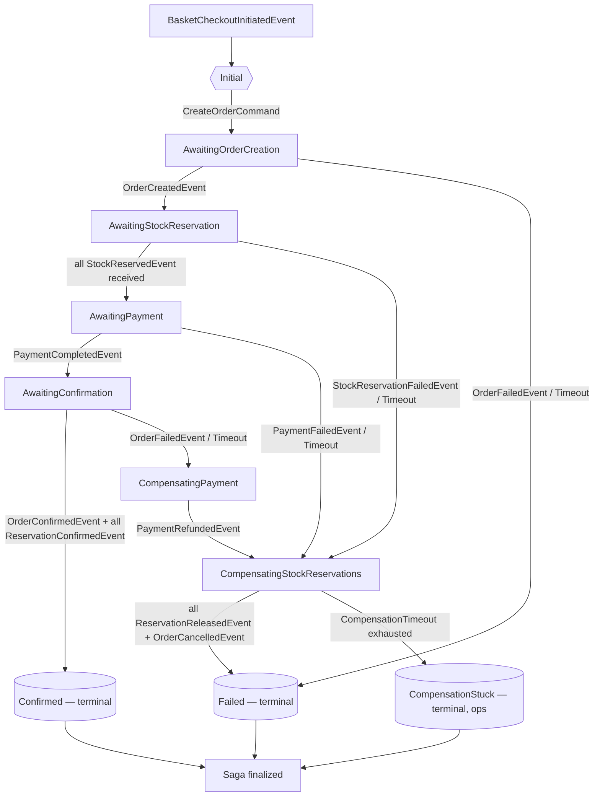

# Checkout Saga Design

> **Status:** DRAFT (Stage 2 Agent 6)
> **Target section in master design:** [eshop-master-design.md § 8](../eshop-master-design.md)
> **Companion ADRs:** [0001](../adr/0001-centralized-saga-orchestration.md), [0004](../adr/0004-checkout-saga-topology.md)
> **Template reference:** `saga/SagaOrchestrators/Payments/PaymentProcessingSaga/` (the remaining reference saga after Weather removal)
> **Placement:** `saga/SagaOrchestrators/Checkout/CheckoutSaga/`

---

## 1. Purpose & Flow Overview

The Checkout Saga is the **orchestrator of the eShop commercial commitment flow** — the multi-step distributed transaction that converts a `BasketCheckoutInitiatedEvent` (from Basket) into either a **Confirmed Order** (happy path) or a **Compensated Order** (any failure path). It coordinates four downstream bounded contexts and one sub-saga:

- **Ordering** (create order, then later confirm or cancel the order),
- **Inventory** (reserve stock per item before payment, then later confirm or release the reservation),
- **PaymentProcessingSaga** (delegated sub-saga, existing — handled via `RequestPaymentCommand` / `PaymentCompletedEvent` / `PaymentFailedEvent` / `PaymentRefundedEvent`),
- **Ordering again** at the confirmation step (`ConfirmOrderCommand`).

The saga is **centralized** per [ADR-0001](../adr/0001-centralized-saga-orchestration.md) and lives in `saga/SagaOrchestrators/Checkout/CheckoutSaga/`, following the exact folder layout of `Orders/PaymentProcessingSaga/`. Its state machine extends `MassTransitStateMachine<CheckoutSagaState>`, its state is persisted to the shared `saga` PostgreSQL schema, and it communicates with downstream services exclusively via Kafka (Avro-serialized via `Platform.Avro.UniversalSerDes`, published through the transactional outbox).

**Step order (per [ADR-0004](../adr/0004-checkout-saga-topology.md)):** *Create Order → Reserve Stock → Process Payment → Confirm Order → Confirm Reservations*. Stock is reserved **before** payment. This ordering is the industry standard for consumer commerce (Amazon, eBay, most large marketplaces), guarantees the customer a reservation before being charged, and produces a well-defined compensation path on payment failure (release reservations, cancel order — no refund needed because payment never captured). Full rationale in § 13.

### 1.1 High-level flow diagram



### 1.2 Why a dedicated saga (not embedded in Ordering)

Ordering is a command responder — it owns the Order aggregate and its status FSM. If checkout orchestration lived in Ordering, Ordering would have to consume Inventory events (`StockReservedEvent`, `StockReservationFailedEvent`, `ReservationReleasedEvent`) and Payments events (`PaymentCompletedEvent`, `PaymentFailedEvent`, `PaymentRefundedEvent`), violating the autonomy-as-command-responder driver from ADR-0001. The saga-in-its-own-service pattern keeps Ordering clean and gives the orchestration a single home.

---

## 2. State Class — `CheckoutSagaState`

Implements `ISagaStateInstance, IAuditableEntity` (same base as `PaymentProcessingSagaState`). Persisted in the shared `saga` schema via EF Core with `ConcurrencyMode.Optimistic`. MemoryPack not required — saga state uses EF Core mapping.

| Property | Type | When Populated | Notes |
|----------|------|---------------|-------|
| `CorrelationId` | `Guid` | Factory (init) | Equals `BasketCheckoutInitiatedEvent.BasketCorrelationId`. Immutable after first set. Also drives the downstream Order aggregate's `CorrelationId`. |
| `CurrentState` | `string` | MassTransit (auto) | State machine state name. |
| `RowVersion` | `uint` | EF Core interceptor | Optimistic concurrency token. |
| **— Buyer/user data (captured at init) —** | | | |
| `UserId` | `Guid` | On `BasketCheckoutInitiatedSagaEvent` | From Basket event. Becomes Ordering's `BuyerId`. |
| `TotalAmount` | `decimal` | On `BasketCheckoutInitiatedSagaEvent` | Sum of line totals as captured by Basket. |
| `Currency` | `string` | On `BasketCheckoutInitiatedSagaEvent` | ISO 4217. |
| `PaymentMethodId` | `Guid` | On `BasketCheckoutInitiatedSagaEvent` | Pass-through to Payments. |
| `BasketSnapshotJson` | `string` (jsonb) | On `BasketCheckoutInitiatedSagaEvent` | Serialized `IReadOnlyList<CheckoutItemSnapshot>` (ProductId, Sku, Name, Quantity, UnitPriceAmount, LineTotal). Stored as a single jsonb column to avoid a child table — the snapshot is immutable for the saga's lifetime. See § 2.1. |
| `ShippingAddressJson` | `string` (jsonb) | On `BasketCheckoutInitiatedSagaEvent` | Serialized Address value object. Captured from the checkout-initiation event payload (Basket does not currently carry shipping address; the source of the address is covered in § 2.2). |
| `BillingAddressJson` | `string` (jsonb) | On `BasketCheckoutInitiatedSagaEvent` | Same pattern as shipping. |
| `InitiatedAtUtc` | `DateTimeOffset` | On `BasketCheckoutInitiatedSagaEvent` | Copied from the event. Saga-run start time. |
| **— Ordering-side data (filled during saga) —** | | | |
| `OrderId` | `Guid?` | On `OrderCreatedSagaEvent` | Ordering's aggregate id — set after `OrderCreatedEvent` arrives back on `ordering.orders`. |
| `OrderCreatedAtUtc` | `DateTimeOffset?` | On `OrderCreatedSagaEvent` | Timestamp from the Ordering event. |
| **— Inventory-side data (filled progressively) —** | | | |
| `ReservationIdsJson` | `string` (jsonb) | Progressive, during `AwaitingStockReservation` | Serialized `IDictionary<Guid ProductId, ReservationTracking>` — one entry per distinct ProductId in the basket. `ReservationTracking = { Status (Pending/Reserved/Failed/Released/Confirmed), ReservationId (nullable), ReservedAtUtc, ExpiresAtUtc }`. Updated on every `StockReservedSagaEvent` / `StockReservationFailedSagaEvent` / `ReservationReleasedSagaEvent` / `ReservationConfirmedSagaEvent`. See § 5 for the fan-out algorithm. |
| `ExpectedReservations` | `int` | Set at fan-out (when transitioning into `AwaitingStockReservation`) | Count of distinct ProductIds. |
| `PendingReservations` | `int` | Decremented on each `StockReservedSagaEvent` | Zero triggers transition to `AwaitingPayment`. |
| `StockReservationStartedAtUtc` | `DateTimeOffset?` | On transition into `AwaitingStockReservation` | For latency observability. |
| `StockReservationCompletedAtUtc` | `DateTimeOffset?` | When `PendingReservations` reaches 0 | For latency observability. |
| **— Payment-side data (delegated to PaymentProcessingSaga) —** | | | |
| `PaymentTransactionId` | `Guid?` | On `PaymentCompletedSagaEvent` | Payments's transaction id. Required for compensation refund. |
| `PaymentRequestedAtUtc` | `DateTimeOffset?` | On transition into `AwaitingPayment` | |
| `PaymentCompletedAtUtc` | `DateTimeOffset?` | On `PaymentCompletedSagaEvent` | |
| **— Confirmation timestamps —** | | | |
| `OrderConfirmationRequestedAtUtc` | `DateTimeOffset?` | On transition into `AwaitingConfirmation` | |
| `OrderConfirmedAtUtc` | `DateTimeOffset?` | On `OrderConfirmedSagaEvent` | |
| **— Compensation state —** | | | |
| `CompensationStartedAtUtc` | `DateTimeOffset?` | On first transition into any `Compensating*` state | For observability + stuck-saga detection. |
| `CompensationCompletedAtUtc` | `DateTimeOffset?` | On transition into `Compensated` | |
| `CompensationTriggered` | `bool` | Set `true` on first `Compensating*` transition | Mirrors the `PaymentProcessingSagaState.CompensationTriggered` field. |
| `ErrorCode` | `string?` | On any failure event | E.g., `STOCK_UNAVAILABLE`, `PAYMENT_FAILED`, `PAYMENT_TIMEOUT`, `CONFIRMATION_FAILED`, `ORDER_CREATION_TIMEOUT`, `COMPENSATION_TIMEOUT`. |
| `ErrorMessage` | `string?` | On any failure event | Human-readable. |
| `FailedAtState` | `string?` | On any failure event | Name of the state when failure first occurred — aids ops forensics. |
| **— Timeout tokens (MassTransit scheduler) —** | | | |
| `OrderCreationTimeoutTokenId` | `Guid?` | Scheduler-managed | |
| `StockReservationTimeoutTokenId` | `Guid?` | Scheduler-managed | |
| `PaymentTimeoutTokenId` | `Guid?` | Scheduler-managed | |
| `OrderConfirmationTimeoutTokenId` | `Guid?` | Scheduler-managed | |
| `CompensationTimeoutTokenId` | `Guid?` | Scheduler-managed | |
| **— Audit (IAuditableEntity) —** | | | |
| `CreatedUtc` | `DateTimeOffset` | EF Core interceptor | Saga row creation. |
| `LastModifiedUtc` | `DateTimeOffset` | EF Core interceptor | Row last mutation. |

### 2.1 Why `BasketSnapshotJson` / `ReservationIdsJson` are single jsonb columns

Two concerns favour single-column serialization over child tables on the saga state:

1. **Saga state is short-lived and opaque.** The saga reads/writes its own state — nothing else queries it. There is no reporting need to index into individual line items from the saga row; observability gets that from projections in Ordering and Inventory.
2. **EF Core optimistic-concurrency semantics are cleaner on a single row.** A child-table model would either require cascading saves (fragile) or manual tracking (defeats the state machine's declarative style). Jsonb gives atomic read-modify-write with a single `RowVersion` check.

If snapshot size becomes a concern (baskets are capped at 50 items, so ~5 KB per row worst-case — negligible), the trade-off still favours simplicity.

### 2.2 Where addresses come from

`BasketCheckoutInitiatedEvent` as defined in `docs/bc-design/basket.md § 8.2` does **not** carry shipping/billing addresses — Basket is address-ignorant (per ADR-0003 it is a technical BC). There are two paths:

- **Option P (deferred to Stage 4 / ADR-0004):** the API caller (BFF) POSTs addresses alongside the checkout command and Basket's outbox-handler enriches `BasketCheckoutInitiatedEvent` with them.
- **Option Q (alternative):** the Ordering service fetches the buyer's default addresses during `CreateOrderCommand` handling from a Profiles BC (deferred per Appendix C of the master design).

This saga design **assumes Option P** — the event arrives with `ShippingAddress` and `BillingAddress`. Stage 2 Agent 5 (event catalog) must confirm this by updating the Avro schema, or the ADR must commit to Option Q and this saga would not store addresses at all (just pass the `BuyerId` to Ordering). For the reference solution, Option P is recommended — it keeps Ordering a plain command receiver.

---

## 3. States

All states are `public State` properties on `CheckoutSagaOrchestrator`. MassTransit persists `CurrentState` as the state name string. Terminal states are identified via a `TerminalStates` static array on `CheckoutSagaState` for the stuck-saga health check.

### Happy path states

1. **`Initial`** — MassTransit-implicit initial state. The saga has no row in the repository yet. Entry on `BasketCheckoutInitiatedSagaEvent`.
2. **`AwaitingOrderCreation`** — the saga has been instantiated, `CreateOrderCommand` has been published to `ordering.order-commands`, and an `OrderCreationTimeout` schedule is armed. The saga is waiting for `OrderCreatedSagaEvent` (positive) or `OrderFailedSagaEvent` / timeout (negative).
3. **`AwaitingStockReservation`** — `OrderId` has been captured, `ReserveStockCommand`s have been fanned out (one per distinct ProductId), `ExpectedReservations` counter is set, and `StockReservationTimeout` is armed. The saga is accumulating `StockReservedSagaEvent`s and watching for any `StockReservationFailedSagaEvent`. **Entry action**: publish N commands (fan-out). **Exit conditions**: all N successes → `AwaitingPayment`; any failure → `CompensatingStockReservations`; timeout → `CompensatingStockReservations`.
4. **`AwaitingPayment`** — all reservations confirmed; `RequestPaymentCommand` has been published to `payments.payment-commands` (delegates to `PaymentProcessingSaga`); `PaymentTimeout` is armed. Waiting for `PaymentCompletedSagaEvent` or `PaymentFailedSagaEvent`/timeout.
5. **`AwaitingConfirmation`** — payment captured. Saga has published `ConfirmOrderCommand` to Ordering and one `ConfirmReservationCommand` per active reservation to Inventory. `OrderConfirmationTimeout` is armed. Waiting for `OrderConfirmedSagaEvent`. Individual `ReservationConfirmedSagaEvent`s are observed but NOT the gating event (Inventory auto-confirms on command; the gate is Ordering's confirm). If Ordering confirm fails/timeouts → `CompensatingPayment` (payment captured, must refund).
6. **`Confirmed`** (terminal) — happy path complete. `SetCompletedWhenFinalized()` removes the saga instance after a configurable window.

### Compensation states

7. **`CompensatingStockReservations`** — at least one reservation may exist and must be released. Entry actions: (a) publish `ReleaseReservationCommand` for every `ReservationId` currently in `Reserved` status in `ReservationIdsJson`; (b) publish `CancelOrderCommand` to Ordering (if `OrderId` is set); (c) arm `CompensationTimeout`. Waits for `ReservationReleasedSagaEvent` per in-flight reservation (match against the tracking dictionary). Transitions to `Compensated` when every dispatched release has been confirmed AND Ordering has acked the cancel (via `OrderCancelledSagaEvent`).
8. **`CompensatingPayment`** — reached only when payment has been captured and a later step failed (Ordering confirm). Entry actions: (a) publish `RequestRefundCommand` to `payments.payment-commands` (`PaymentProcessingSaga` handles it); (b) arm `CompensationTimeout`. On `PaymentRefundedSagaEvent`, transitions to `CompensatingStockReservations` (refund done → release stock).
9. **`Compensated`** (terminal) — all compensations complete. Saga publishes a terminal `CheckoutFailedEvent` for downstream consumers (Notifications, BFF cache invalidation) — this is the saga-level failure event that Ordering does not emit on its own because Ordering only knows about its own cancellation, not the broader saga failure. **Open question — Stage 2 Agent 5:** decide whether `CheckoutFailedEvent` is a separate schema or whether `OrderCancelledEvent + OrderFailedEvent` from Ordering are sufficient. This design assumes a separate `CheckoutFailedEvent` on a new `checkout.sagas` topic for symmetry with `CheckoutCompletedEvent` (see § 9).
10. **`Failed`** (terminal) — reached when no compensation is required (e.g., `OrderFailedEvent` in `AwaitingOrderCreation` before stock was touched; or `OrderCreationTimeout` where the command was presumed never accepted). The saga simply emits `CheckoutFailedEvent` and finalizes.
11. **`CompensationStuck`** (terminal, abnormal) — reached when `CompensationTimeout` fires while in any `Compensating*` state. Emits `CheckoutStuckEvent` (ops alert), does NOT auto-retry, and remains finalized for manual operator intervention. The stuck-saga health check in `SagaHealthCheck` already counts sagas in non-terminal states older than `StuckSagaThresholdMinutes`; `CompensationStuck` is explicitly terminal so it does not inflate that metric — operators track these separately via the dedicated counter (§ 11).

---

## 4. Transition Table

Current State | Triggering Event | Action(s) Taken | Next State
---|---|---|---
`Initial` | `BasketCheckoutInitiatedSagaEvent` | Capture UserId, Items, Total, Currency, PaymentMethodId, Shipping/Billing, InitiatedAtUtc. Publish `CreateOrderCommand` to `ordering.order-commands` (key = `CorrelationId`). Arm `OrderCreationTimeout`. | `AwaitingOrderCreation`
`AwaitingOrderCreation` | `OrderCreatedSagaEvent` | Capture `OrderId`, `OrderCreatedAtUtc`. Unschedule `OrderCreationTimeout`. Compute `ExpectedReservations = distinct(ProductId).Count`. Initialize `ReservationIdsJson` with `Pending` entries per ProductId. Publish N `ReserveStockCommand` to `inventory.reservation-commands` (key = `ProductId`, one per distinct ProductId with summed quantities). Arm `StockReservationTimeout`. Set `StockReservationStartedAtUtc`. | `AwaitingStockReservation`
`AwaitingOrderCreation` | `OrderFailedSagaEvent` | Capture ErrorCode/Message, FailedAtState. Unschedule `OrderCreationTimeout`. Publish `CheckoutFailedEvent` (no compensation — nothing touched downstream yet). | `Failed` (finalize)
`AwaitingOrderCreation` | `OrderCreationTimeout.Received` | Set ErrorCode=`ORDER_CREATION_TIMEOUT`, ErrorMessage. Publish `MarkOrderFailedCommand` to Ordering (in case Ordering did actually accept the command but the reply got lost — defensive). Publish `CheckoutFailedEvent`. | `Failed` (finalize)
`AwaitingStockReservation` | `StockReservedSagaEvent` (one of N) | Append `ReservationId` to `ReservationIdsJson` entry, set Status=`Reserved`, decrement `PendingReservations`. **If `PendingReservations > 0`**: stay in state; **if `PendingReservations == 0`**: unschedule `StockReservationTimeout`. Set `StockReservationCompletedAtUtc`. Publish `RequestPaymentCommand` to `payments.payment-commands` (key = `CorrelationId`). Arm `PaymentTimeout`. Set `PaymentRequestedAtUtc`. | `AwaitingPayment` (when counter reaches 0; else stays)
`AwaitingStockReservation` | `StockReservationFailedSagaEvent` | Mark the matching ProductId's tracking entry Status=`Failed`. Unschedule `StockReservationTimeout`. Set ErrorCode=`STOCK_UNAVAILABLE`, ErrorMessage (include shortfall). Mark `CompensationTriggered=true`. Set `CompensationStartedAtUtc`. For all entries currently Status=`Reserved`, publish `ReleaseReservationCommand` (key = ProductId). Publish `CancelOrderCommand` to Ordering (key = OrderId). Arm `CompensationTimeout`. | `CompensatingStockReservations`
`AwaitingStockReservation` | `StockReservationTimeout.Received` | Same as `StockReservationFailedSagaEvent` except ErrorCode=`STOCK_TIMEOUT`. Release whatever was reserved so far. | `CompensatingStockReservations`
`AwaitingPayment` | `PaymentCompletedSagaEvent` | Capture `PaymentTransactionId`, `PaymentCompletedAtUtc`. Unschedule `PaymentTimeout`. Publish `ConfirmOrderCommand` to Ordering. Publish `ConfirmReservationCommand` per active reservation (key = ProductId). Arm `OrderConfirmationTimeout`. Set `OrderConfirmationRequestedAtUtc`. | `AwaitingConfirmation`
`AwaitingPayment` | `PaymentFailedSagaEvent` | Capture ErrorCode/Message (`PAYMENT_FAILED`). Unschedule `PaymentTimeout`. Mark `CompensationTriggered=true`. For all active reservations, publish `ReleaseReservationCommand`. Publish `CancelOrderCommand`. Arm `CompensationTimeout`. Note: payment did not capture — no refund needed. | `CompensatingStockReservations`
`AwaitingPayment` | `PaymentTimeout.Received` | Treat as `PaymentFailedSagaEvent` with ErrorCode=`PAYMENT_TIMEOUT`. | `CompensatingStockReservations`
`AwaitingConfirmation` | `OrderConfirmedSagaEvent` | Capture `OrderConfirmedAtUtc`. Unschedule `OrderConfirmationTimeout`. Publish `CheckoutCompletedEvent` to `checkout.sagas` (informational, see § 9). | `Confirmed` (finalize)
`AwaitingConfirmation` | `ReservationConfirmedSagaEvent` (0..N) | Update tracking entry Status=`Confirmed`. Purely informational — does not gate state transition. No side effects published. | `AwaitingConfirmation` (stays)
`AwaitingConfirmation` | `OrderFailedSagaEvent` | Capture ErrorCode/Message (`CONFIRMATION_FAILED`). Mark `CompensationTriggered=true`. Publish `RequestRefundCommand`. Arm `CompensationTimeout`. Defer stock release until refund completes. | `CompensatingPayment`
`AwaitingConfirmation` | `OrderConfirmationTimeout.Received` | Treat as `OrderFailedSagaEvent` with ErrorCode=`CONFIRMATION_TIMEOUT`. | `CompensatingPayment`
`CompensatingStockReservations` | `ReservationReleasedSagaEvent` (0..M) | Update tracking entry Status=`Released`. Decrement `PendingReleases`. **If `PendingReleases > 0` OR OrderCancelled not yet received**: stay. **If all released AND `OrderCancelledSagaEvent` received**: unschedule `CompensationTimeout`. Set `CompensationCompletedAtUtc`. Publish `CheckoutFailedEvent` (with `CompensationTriggered=true`). | `Compensated` (finalize, if gate met)
`CompensatingStockReservations` | `OrderCancelledSagaEvent` | Mark Ordering cancellation complete. Gate check against reservation releases (same gate as above). | `Compensated` (finalize, if gate met)
`CompensatingStockReservations` | `CompensationTimeout.Received` | Set ErrorCode=`COMPENSATION_TIMEOUT`, ErrorMessage=`Stock compensation did not complete in time`. Publish `CheckoutStuckEvent` for ops. | `CompensationStuck` (finalize, abnormal)
`CompensatingPayment` | `PaymentRefundedSagaEvent` | Capture refund acknowledged. Now publish `ReleaseReservationCommand`s for all active reservations + `CancelOrderCommand`. Reset `CompensationTimeout` counter (fresh schedule for stock phase). | `CompensatingStockReservations`
`CompensatingPayment` | `CompensationTimeout.Received` | Set ErrorCode=`COMPENSATION_TIMEOUT`, ErrorMessage=`Refund did not complete in time`. Publish `CheckoutStuckEvent`. | `CompensationStuck` (finalize, abnormal)

### 4.1 Event correlation policy

All external events use `e.CorrelateById(ctx => ctx.Message.CorrelationId)` where `CorrelationId` is the saga correlation id. The `OrderCreatedSagaEvent`, `StockReservedSagaEvent`, `StockReservationFailedSagaEvent`, `ReservationReleasedSagaEvent`, `ReservationConfirmedSagaEvent` all carry this `CorrelationId` field — the consumer-adapters (§ 6) extract it from the Kafka message payload.

**OnMissingInstance policy:** all intermediate events use `.OnMissingInstance(m => m.Discard())` — if no saga exists for that CorrelationId (because the saga has already finalized, or the event arrived before the saga was created due to out-of-order partitions), the event is dropped with a log entry. **Exception:** `BasketCheckoutInitiatedSagaEvent` is the initiator — `.Initially(...)` handles it on a missing instance.

### 4.2 Concurrency inside one saga instance

MassTransit's `EntityFrameworkRepository` with `ConcurrencyMode.Optimistic` serializes state mutations for one `CorrelationId` via a CAS loop on `RowVersion`. Conflicting concurrent events for the same saga are retried per `UseMessageRetry` (see appsettings `MaxRetryAttempts=3`, backoff `RetryDelaySeconds=5`). This means **within one saga instance, transitions are serialized** — a concurrent `StockReservedSagaEvent` and `StockReservationFailedSagaEvent` arriving in any order are applied one at a time in some order; the state machine's guards (see § 5 race conditions) ensure correctness regardless of interleave.

---

## 5. Fan-out for Multi-Item Reservation

### 5.1 Problem

A basket can have up to 50 distinct products. The saga must:

- Emit one `ReserveStockCommand` per distinct ProductId (not per basket line item — quantities are summed up front because Basket guarantees no duplicate ProductId per § 2.1 of `basket.md`, so the sum step is a no-op in practice).
- Accumulate results over time: N success events OR one failure event OR timeout.
- Transition only when all are accounted for — partial success + partial pending is NOT a green light for payment.

### 5.2 Algorithm

**On transition into `AwaitingStockReservation` (entry action from `AwaitingOrderCreation` → `OrderCreatedSagaEvent` branch):**

```
1. Let items = deserialize(state.BasketSnapshotJson)
2. Let productGroups = items.GroupBy(i => i.ProductId)
                            .Select(g => new { ProductId = g.Key,
                                               TotalQuantity = g.Sum(i => i.Quantity) })
3. state.ExpectedReservations = productGroups.Count
4. state.PendingReservations = productGroups.Count
5. state.ReservationIdsJson = serialize(productGroups.ToDict(g => g.ProductId,
                                                              g => new ReservationTracking {
                                                                  Status = "Pending",
                                                                  ReservationId = null,
                                                                  ReservedAtUtc = null,
                                                                  ExpiresAtUtc = null
                                                              }))
6. for each group in productGroups:
       publish ReserveStockCommand {
           ReservationId = Guid.CreateVersion7(),    // saga-assigned; Inventory uses this as the reservation key
           ProductId = group.ProductId,
           OrderId = state.OrderId.Value,
           Quantity = group.TotalQuantity,
           RequestedAtUtc = timeProvider.GetUtcNow()
       } to topic inventory.reservation-commands
         with key = group.ProductId.ToString()
7. Arm StockReservationTimeout schedule.
```

The `ReservationId` is **generated by the saga** and passed INTO Inventory. This is intentional: it means the saga is the authority on "what reservation id did I ask for?" and can compensate with the same id even if the Inventory-side `StockReservedEvent` is lost. (Inventory echoes the same `ReservationId` in its success event.)

**On `StockReservedSagaEvent`:**

```
1. Let tracking = deserialize(state.ReservationIdsJson)
2. Let entry = tracking[event.ProductId]
3. If entry.Status != "Pending":
       // duplicate delivery, stale event, or race — idempotency guard
       log warn and return (no-op)
4. entry.Status = "Reserved"
   entry.ReservationId = event.ReservationId
   entry.ReservedAtUtc = event.ReservedAtUtc
   entry.ExpiresAtUtc = event.ExpiresAtUtc
5. state.ReservationIdsJson = serialize(tracking)
6. state.PendingReservations = tracking.Values.Count(t => t.Status == "Pending")
7. If state.PendingReservations == 0:
       state.StockReservationCompletedAtUtc = timeProvider.GetUtcNow()
       Unschedule StockReservationTimeout
       Publish RequestPaymentCommand
       Arm PaymentTimeout
       TransitionTo(AwaitingPayment)
   Else:
       stay in AwaitingStockReservation
```

**On `StockReservationFailedSagaEvent` (any one arrives):**

```
1. Update tracking: entry for event.ProductId -> Status = "Failed"
2. Unschedule StockReservationTimeout
3. Set ErrorCode = "STOCK_UNAVAILABLE", ErrorMessage = $"Product {event.ProductId} unavailable: requested {event.RequestedQuantity}, available {event.AvailableQuantity}"
4. Set CompensationTriggered = true, CompensationStartedAtUtc = now, FailedAtState = "AwaitingStockReservation"
5. For each entry in tracking where Status == "Reserved":
       publish ReleaseReservationCommand {
           ReservationId = entry.ReservationId,
           ProductId = productId,
           ReleaseReason = "Compensation"
       } to topic inventory.reservation-commands with key = productId.ToString()
6. publish CancelOrderCommand to topic ordering.order-commands with key = OrderId.ToString()
7. Arm CompensationTimeout
8. TransitionTo(CompensatingStockReservations)
```

### 5.3 Race conditions and ordering guarantees

- **Inside one saga instance, MassTransit serializes message handling** (documented by MassTransit; this is also our `ConcurrencyMode.Optimistic` repository contract). So a `StockReservedSagaEvent` and a `StockReservationFailedSagaEvent` arriving concurrently for the same saga are handled one at a time. If the success lands first, the tracking entry goes `Pending → Reserved`. The later failure then lands, and its guard sees `Status == "Reserved"` for the *other* (failed) ProductId — it updates that entry and triggers compensation that includes releasing the `Reserved` one. Correctness preserved.
- **Kafka partition ordering:** `ReserveStockCommand` messages are keyed by `ProductId`, so Inventory's consumer processes commands for the same SKU in order. Cross-ProductId ordering is NOT guaranteed — a fast Inventory instance can reply for ProductId X before it replies for ProductId Y. The saga's counter approach (counts are commutative over positive outcomes) is robust to this. Failures are "first arrival wins" — the first failure aborts the flow.
- **Duplicate deliveries:** Kafka is at-least-once. Consumer-adapter plus idempotency guard (`if entry.Status != "Pending"` skip) keeps saga state correct.
- **Delayed failures after overall success:** If all successes land, saga transitions to `AwaitingPayment`, and then a stale `StockReservationFailedSagaEvent` arrives (e.g., a retry from before), the state machine has already left `AwaitingStockReservation`. With `During(AwaitingStockReservation, When(StockReservationFailedEvent)...)` and default MassTransit semantics, events received in a state they are NOT `During`d in are simply ignored (unless `Ignore(...)` or a catch-all is configured). That is the desired behavior. The stale failure is dropped. Operational note: a warning log entry MUST be emitted by the consumer-adapter so that operators can see the dangling message in traces.

### 5.4 Edge case — basket with exactly one distinct ProductId

`ExpectedReservations == 1`, `PendingReservations == 1`. Single-success or single-failure outcome. The fan-out logic degrades correctly; no special casing needed.

### 5.5 Edge case — duplicate `ReserveStockCommand` delivery (saga crash-restart)

If the saga crashes between publishing `ReserveStockCommand` and the outbox commit, MassTransit's outbox pattern replays the publish on recovery. Inventory receives two copies of the command. Inventory's idempotency keyed on `ReservationId` (saga-assigned) means the second copy is a no-op. This is why the saga mints the ReservationId itself — it is the portable idempotency key that survives both sides of the transport.

---

## 6. Compensation Matrix

| Failure Point | State when failure observed | Side effects already in flight | Compensation dispatched | Terminal state |
|---|---|---|---|---|
| Order creation fails (`OrderFailedSagaEvent`) | `AwaitingOrderCreation` | None — no Inventory or Payments calls made yet. Ordering may or may not have a row (if it did, it transitioned to Failed on its own). | None. Publish `CheckoutFailedEvent`. | `Failed` |
| Order creation times out (`OrderCreationTimeout`) | `AwaitingOrderCreation` | Ordering *might* have accepted the command and replied lost. Be defensive. | Publish `MarkOrderFailedCommand` to Ordering. Publish `CheckoutFailedEvent`. | `Failed` |
| Stock reservation fails (partial or full) (`StockReservationFailedSagaEvent`) | `AwaitingStockReservation` | Ordering has `Status=Created` (Order exists). Some reservations may be `Reserved` already. | Release all `Reserved` entries + `CancelOrderCommand`. Arm `CompensationTimeout`. On all `ReservationReleasedSagaEvent` + `OrderCancelledSagaEvent`: publish `CheckoutFailedEvent`. | `Compensated` |
| Stock reservation times out (`StockReservationTimeout`) | `AwaitingStockReservation` | Same as above — partial reservations possible. | Same as above, ErrorCode=`STOCK_TIMEOUT`. | `Compensated` |
| Payment fails (`PaymentFailedSagaEvent`) | `AwaitingPayment` | Ordering=`StockReserved`, all Inventory reservations active. NO capture at Payments (by PaymentProcessingSaga's contract). | Release all reservations + `CancelOrderCommand`. Arm `CompensationTimeout`. **No refund** — payment never captured. | `Compensated` |
| Payment times out (`PaymentTimeout`) | `AwaitingPayment` | Same — assume payment not captured. (PaymentProcessingSaga has its own internal timeouts; reaching this outer timeout implies no positive reply, treat as failure.) | Same as payment fail, ErrorCode=`PAYMENT_TIMEOUT`. | `Compensated` |
| Order confirmation fails (`OrderFailedSagaEvent` in `AwaitingConfirmation`) | `AwaitingConfirmation` | Ordering=`PaymentCompleted`, all reservations active, Payments captured payment. | **Refund first**: publish `RequestRefundCommand` → wait `PaymentRefundedSagaEvent` → then publish `ReleaseReservationCommand`s + `CancelOrderCommand` → wait their acks → `CheckoutFailedEvent`. Two-phase compensation. | `Compensated` |
| Order confirmation times out (`OrderConfirmationTimeout`) | `AwaitingConfirmation` | Same as above. | Same two-phase compensation, ErrorCode=`CONFIRMATION_TIMEOUT`. | `Compensated` |
| `CompensationTimeout` fires in `CompensatingStockReservations` | `CompensatingStockReservations` | Releases may be hung at Inventory (message broker dead-letter, Inventory crashed, etc.). | None. Emit `CheckoutStuckEvent` (ops alert). | `CompensationStuck` |
| `CompensationTimeout` fires in `CompensatingPayment` | `CompensatingPayment` | Refund may be hung at PaymentProcessingSaga. | None. Emit `CheckoutStuckEvent`. | `CompensationStuck` |

### 6.1 Two-phase compensation rationale

At `AwaitingConfirmation` failure, the saga has **both** live reservations AND a captured payment. The order matters:

- **Refund first, then release stock.** A refund failure should not leave money in Payments while stock is already released (customer sees "cancelled but no refund"). The refund is riskier — it involves gateway traffic — so it goes first.
- The alternative (release first, then refund) risks "stock returned to shelf, sold to someone else, refund fails, customer with no stock AND no refund" — worse UX.

The two-phase compensation adds at most ~30 seconds of latency before reservations come off-hand; given the rarity of confirmation-stage failure (typical cause: Ordering service crash post-payment), the trade is correct.

---

## 7. Timeouts

Each awaiting-* state has a MassTransit schedule. Values are overridable via configuration. Defaults were chosen based on the kind of work each phase does:

- `OrderCreationTimeout`: **30 seconds**. Ordering is a local DB write via Kafka consumer. No external I/O. 30s is generous; p99 should be well under 5s.
- `StockReservationTimeout`: **60 seconds**. Per-item events fan-in; worst case is a slow Inventory consumer processing tens of commands sequentially per partition. Event Sourcing in Inventory (§ 8 of `inventory.md`) has heavier write path than a row update. 60s allows headroom.
- `PaymentTimeout`: **90 seconds**. Involves `PaymentProcessingSaga` which has its own `AuthorizationMinutes: 5` and `CaptureMinutes: 5` internal timeouts — but those are per-step. The outer Checkout timeout must be shorter than the inner ones' sum to avoid a race where the sub-saga is still trying while the outer already gave up. **Trade-off note**: if `PaymentTimeout` fires while the sub-saga is still running, the outer compensation proceeds (release stock), and the sub-saga may later succeed in capturing — the outer then receives a late `PaymentCompletedSagaEvent` for a finalized saga, which is discarded. This produces a captured-but-compensated state. Mitigation: set the outer timeout ≥ the sub-saga's AuthorizationMinutes + CaptureMinutes + buffer. 90s is enough for gateway p99 latency; increase to 3-5 minutes if production data disagrees.
- `OrderConfirmationTimeout`: **30 seconds**. Local DB write at Ordering; similar to creation.
- `CompensationTimeout`: **300 seconds** (5 minutes). Compensation has to complete N releases + 1 cancel OR 1 refund + N releases + 1 cancel. With per-step processing at ~1s each and potential retries, 5 min is cushion. Beyond this, `CompensationStuck` fires and ops takes over.

### 7.1 Configuration section

Added to `saga/SagaOrchestrators/appsettings.json` under the existing `Saga` section. Mirrors the shape of the existing and `PaymentProcessingTimeouts` sub-sections:

```json
{
  "Saga": {
    "PaymentProcessingTimeouts": { /* existing */ },
    "CheckoutTimeouts": {
      "OrderCreationSeconds": 30,
      "StockReservationSeconds": 60,
      "PaymentSeconds": 90,
      "OrderConfirmationSeconds": 30,
      "CompensationSeconds": 300
    },
    "MaxRetryAttempts": 3,
    "RetryDelaySeconds": 5,
    "ConcurrencyLimit": 10
  }
}
```

Bound to a new `CheckoutTimeoutsOptions` sub-section on `SagaOptions` alongside the existing `PaymentProcessingTimeouts`. Existing DI pattern handles it.

### 7.2 Relationship to Inventory reservation TTL

Inventory's `ReservationTtl` (default 15 minutes per `inventory.md § 11.3`) is the upper bound on how long a reservation can sit before Inventory's own `ReservationExpiryWorker` auto-releases it. The checkout saga MUST finish (or fail) within that window or Inventory will release the reservation out from under it and the saga receives a late `ReservationReleasedSagaEvent` with `ReleaseReason=Expiry` while still in `AwaitingPayment` or `AwaitingConfirmation`. **Handling** (documented here, deferred to Stage 4 ADR if more weight needed):

- In `AwaitingPayment` / `AwaitingConfirmation`, if `ReservationReleasedSagaEvent.ReleaseReason == Expiry` arrives, it means the reservation TTL beat the saga. The saga MUST treat this as a `StockTimeout`-equivalent: set ErrorCode=`RESERVATION_EXPIRED_DURING_SAGA`, transition to compensating. If in `AwaitingConfirmation` (payment already captured), go `CompensatingPayment` first. The tracking entry for that ProductId goes from `Reserved` to `Released-by-expiry`; no need to issue a second `ReleaseReservationCommand` for it during compensation.
- The timeout stack is therefore: `OrderCreationTimeout (30s) + StockReservationTimeout (60s) + PaymentTimeout (90s) + OrderConfirmationTimeout (30s) = 210s = 3.5 minutes`, well under the 15-minute reservation TTL. Leaves 11+ minutes of slack; compensation has another 5 min. Comfortable.

---

## 8. Consumer-Adapter Inventory

Every external Kafka event has a dedicated adapter that reads the Avro-deserialized record, maps it to an internal saga event record, and publishes via `context.Publish(internalEvent)` (in-memory MassTransit bus → state machine). This pattern is identical to `PaymentProcessingInitiatedConsumer` (§ 6 of `basket.md` → adapter template).

Naming convention: `{EventName}CheckoutConsumer` (suffix `Checkout` so consumer classes don't collide with `PaymentProcessingSaga` consumer classes that handle the same Payments events). Internal events are `{EventName}SagaEvent` in `SagaOrchestrators.Checkout.CheckoutSaga.InternalSagaEvents`.

| External Event (Avro record) | Topic | Consumer Class | Internal Saga Event Produced |
|---|---|---|---|
| `Basket.Sessions.BasketCheckoutInitiatedEvent` | `basket.sessions` | `BasketCheckoutInitiatedConsumer` | `BasketCheckoutInitiatedSagaEvent` (maps `BasketCorrelationId` → `CorrelationId`; carries UserId, Items, TotalAmount, Currency, PaymentMethodId, ShippingAddress, BillingAddress, InitiatedAtUtc) |
| `Ordering.Orders.OrderCreatedEvent` | `ordering.orders` | `OrderCreatedConsumer` | `OrderCreatedSagaEvent` |
| `Ordering.Orders.OrderCancelledEvent` | `ordering.orders` | `OrderCancelledConsumer` | `OrderCancelledSagaEvent` (only relevant during compensation; on all other states OnMissingInstance=Discard) |
| `Ordering.Orders.OrderFailedEvent` | `ordering.orders` | `OrderFailedConsumer` | `OrderFailedSagaEvent` |
| `Ordering.Orders.OrderConfirmedEvent` | `ordering.orders` | `OrderConfirmedConsumer` | `OrderConfirmedSagaEvent` |
| `Inventory.Reservations.StockReservedEvent` | `inventory.reservations` | `StockReservedConsumer` | `StockReservedSagaEvent` (maps `OrderId` → saga correlation via a CorrelationId field; see § 8.1 for mapping strategy) |
| `Inventory.Reservations.StockReservationFailedEvent` | `inventory.reservations` | `StockReservationFailedConsumer` | `StockReservationFailedSagaEvent` |
| `Inventory.Reservations.ReservationReleasedEvent` | `inventory.reservations` | `ReservationReleasedConsumer` | `ReservationReleasedSagaEvent` (discriminates on `ReleaseReason` to distinguish compensation-driven vs expiry-driven) |
| `Inventory.Reservations.ReservationConfirmedEvent` | `inventory.reservations` | `ReservationConfirmedConsumer` | `ReservationConfirmedSagaEvent` |
| `Payments.Transactions.PaymentCompletedEvent` | `payments.transactions` | `PaymentCompletedCheckoutConsumer` | `PaymentCompletedSagaEvent` |
| `Payments.Transactions.PaymentFailedEvent` | `payments.transactions` | `PaymentFailedCheckoutConsumer` | `PaymentFailedSagaEvent` |
| `Payments.Transactions.PaymentRefundedEvent` | `payments.transactions` | `PaymentRefundedCheckoutConsumer` | `PaymentRefundedSagaEvent` |

**Total adapters: 12.**

### 8.1 CorrelationId mapping for Inventory events

Inventory's external events carry `OrderId` (not `CorrelationId`) as the saga-correlation key — because Inventory doesn't know it's part of a saga; it knows orders. The consumer-adapter MUST translate: the saga's `CorrelationId` is the Basket's `CorrelationId`, which is ALSO the Ordering aggregate's `CorrelationId`, which is different from `OrderId`.

**Option A (mapping via Ordering):** the adapter queries Ordering's DB for `OrderId → CorrelationId`. Introduces a cross-service DB dependency from the saga service. **Rejected.**

**Option B (carry CorrelationId in the external event):** add `CorrelationId` field to `Inventory.Reservations.StockReservedEvent` (and siblings). Inventory receives `CorrelationId` on `ReserveStockCommand` and echoes it back in the result event. **Recommended.** This is a schema addition for Stage 2 Agent 5 to land. The `ReserveStockCommand` already has a natural place for a correlation field.

**Option C (keep OrderId, saga-side lookup by OrderId):** the saga indexes state by `CorrelationId`; at consumer level, translate `OrderId → CorrelationId` via a small side-table (`saga.order_correlation_map` populated when `OrderCreatedSagaEvent` is processed). Ugly and fragile. **Rejected.**

This design assumes Option B. The master-design § 6 Event Catalog (Stage 2 Agent 5) will codify the `CorrelationId` field on all saga-participating events.

### 8.2 Adapter skeleton (not code, just shape)

```
public sealed class StockReservedConsumer : IConsumer<Inventory.Reservations.StockReservedEvent>
{
    public async Task Consume(ConsumeContext<Inventory.Reservations.StockReservedEvent> ctx)
    {
        _logger.LogInformation("Received StockReservedEvent for correlation {CorrelationId} product {ProductId}",
                               ctx.Message.CorrelationId, ctx.Message.ProductId);

        await ctx.Publish(new StockReservedSagaEvent {
            CorrelationId   = ctx.Message.CorrelationId,
            ProductId       = ctx.Message.ProductId,
            ReservationId   = ctx.Message.ReservationId,
            OrderId         = ctx.Message.OrderId,
            Quantity        = ctx.Message.Quantity,
            ReservedAtUtc   = ctx.Message.ReservedAtUtc.ToDateTimeOffset(),
            ExpiresAtUtc    = ctx.Message.ExpiresAtUtc.ToDateTimeOffset()
        });
    }
}
```

Every adapter follows the same pattern: log, translate Avro primitives (timestamp-millis → DateTimeOffset, bytes-decimal → decimal), publish.

---

## 9. Commands Published

Commands flow **outbound** from the saga via the transactional outbox. Every publish uses the `.PublishToOutbox(topic, key, factory)` extension established in the Common folder (see `PaymentProcessingSagaOrchestrator` for usage).

| Command / Event | Topic | Partition Key | Triggered In State (transition) | Purpose |
|---|---|---|---|---|
| `CreateOrderCommand` | `ordering.order-commands` | `CorrelationId` | `Initial → AwaitingOrderCreation` | Ask Ordering to create the Order aggregate from the basket snapshot. |
| `MarkOrderFailedCommand` | `ordering.order-commands` | `OrderId` (if known) or `CorrelationId` | `AwaitingOrderCreation → Failed` (on timeout only) | Defensive: if Ordering did accept the creation but reply got lost, tell it to transition to Failed so its state is consistent. |
| `ConfirmOrderCommand` | `ordering.order-commands` | `OrderId` | `AwaitingPayment → AwaitingConfirmation` | Tell Ordering the payment is captured and stock is reserved; transition the aggregate to Confirmed. |
| `CancelOrderCommand` | `ordering.order-commands` | `OrderId` | `AwaitingStockReservation / AwaitingPayment → CompensatingStockReservations` AND `CompensatingPayment → CompensatingStockReservations` | Tell Ordering to cancel — Ordering's `Cancel` method produces `OrderCancelledEvent` which the saga consumes as `OrderCancelledSagaEvent`. |
| `ReserveStockCommand` | `inventory.reservation-commands` | `ProductId` | `AwaitingOrderCreation → AwaitingStockReservation` (fan-out, N copies) | Ask Inventory to reserve N units for ProductId. Carries saga-assigned `ReservationId` (idempotency key) + `CorrelationId`. |
| `ConfirmReservationCommand` | `inventory.reservation-commands` | `ProductId` | `AwaitingPayment → AwaitingConfirmation` (per active reservation) | Tell Inventory the reservation is now a physical commitment — Inventory decrements OnHand. |
| `ReleaseReservationCommand` | `inventory.reservation-commands` | `ProductId` | `AwaitingStockReservation / AwaitingPayment → CompensatingStockReservations` AND `CompensatingPayment → CompensatingStockReservations` (per active reservation) | Tell Inventory to release the hold with `ReleaseReason=Compensation`. |
| `RequestPaymentCommand` | `payments.payment-commands` | `CorrelationId` | `AwaitingStockReservation → AwaitingPayment` | Delegate to `PaymentProcessingSaga` (existing sub-saga). Reuses the schema defined for PaymentProcessingSaga. |
| `RequestRefundCommand` | `payments.payment-commands` | `CorrelationId` | `AwaitingConfirmation → CompensatingPayment` | Delegate refund to `PaymentProcessingSaga`. Reuses existing schema. |
| `CheckoutCompletedEvent` | `checkout.sagas` | `CorrelationId` | `AwaitingConfirmation → Confirmed` | Saga-level terminal event. Informs Notifications ("your order is confirmed!") and BFF (cache invalidate). See § 9.1. |
| `CheckoutFailedEvent` | `checkout.sagas` | `CorrelationId` | `AwaitingOrderCreation / CompensatingStockReservations → Failed / Compensated` | Saga-level terminal event, informs downstream of the saga's overall outcome (distinct from Ordering's per-aggregate events). |
| `CheckoutStuckEvent` | `checkout.sagas` | `CorrelationId` | `Compensating* → CompensationStuck` | Ops alert. Notifications / PagerDuty / Slack integration listens. |

**New topics introduced:** `ordering.order-commands`, `inventory.reservation-commands`, `checkout.sagas`. These need to land in `docker-compose.yaml` (kafka-init) and in the Schema Registry contracts — Stage 2 Agent 5's responsibility.

### 9.1 Why `checkout.sagas` (saga-level terminal events)

Ordering already publishes `OrderConfirmedEvent` and `OrderCancelledEvent` on `ordering.orders`. Why add saga-level equivalents?

Three reasons:

1. **Semantic difference.** `OrderConfirmedEvent` means "the aggregate is Confirmed" — but the saga has more context (payment transaction id, list of reservation ids, saga duration). Rather than bolt that onto Ordering's event, the saga emits its own.
2. **Failure differentiation.** When the saga reaches `Failed`, Ordering emitted `OrderFailedEvent` (or never emitted, if order creation failed). The saga additionally wants to publish a stable "checkout failed" signal with saga-level fields (including e.g., `CompensationTriggered`, `ErrorCode`) that Ordering's event can't carry.
3. **Subscription simplicity.** Notifications ideally subscribes to one topic for checkout outcomes (`checkout.sagas`) rather than needing to join `ordering.orders` + `checkout.sagas`. BFF same.

**Trade-off:** adds a topic + schemas + one more consumer group on Notifications/BFF sides. Justified for the reference solution because it showcases the saga-level event distinct from aggregate-level event. Stage 2 Agent 5 can disagree and push the saga-level fields into Ordering's events — documented as an open question for that stage.

### 9.2 Partition-key choices

- **`CorrelationId` for outbound events not tied to an order yet** (e.g., `CreateOrderCommand` precedes Ordering knowing its own `OrderId`). Co-partitioning on `CorrelationId` ensures Ordering processes all commands for one checkout on the same partition.
- **`OrderId` for commands scoped to a specific order** (after creation) — plays well with Ordering's DB primary key and enables per-order ordering.
- **`ProductId` for Inventory commands** — per Inventory's own design (§ 13.2 of `inventory.md`, keyed by ProductId), so reservations for the same SKU land on the same partition → Inventory's write-path serialization on the stream is preserved.

---

## 10. Registration (CheckoutSagaDependencyInjection shape)

New file: `saga/SagaOrchestrators/Checkout/CheckoutSaga/CheckoutSagaDependencyInjection.cs`. Invoked from the master `SagaDependencyInjection.AddSagaStateMachines` (or as an extension method called from there).

```text
// pseudocode — final shape belongs to the implementation agent

public static class CheckoutSagaDependencyInjection
{
    extension(IBusRegistrationConfigurator cfg)
    {
        public void AddCheckoutSaga(SagaOptions sagaOptions)
        {
            cfg.AddSagaStateMachine<CheckoutSagaOrchestrator, CheckoutSagaState>()
               .EntityFrameworkRepository(r =>
               {
                   r.ConcurrencyMode = ConcurrencyMode.Optimistic;
                   r.ExistingDbContext<SagaDbContext>();
                   r.UsePostgres();
               })
               .Endpoint(e =>
               {
                   e.ConcurrentMessageLimit = sagaOptions.ConcurrencyLimit;
                   e.PrefetchCount = sagaOptions.ConcurrencyLimit * 2;
               });
        }

        public void ConfigureCheckoutSagaKafkaConsumers(
            IKafkaFactoryConfigurator kafkaConfigurator,
            IBusRegistrationContext ctx,
            ISchemaRegistryClient schemaRegistry,
            KafkaOptions kafkaOptions)
        {
            // One endpoint per consumed topic, grouped under one consumer group.
            // Pattern copied from ConfigurePaymentProcessingSagaConsumers.

            kafkaConfigurator.TopicEndpoint<BasketCheckoutInitiatedEvent>(
                kafkaOptions.Topics.BasketSessions,
                kafkaOptions.ConsumerGroups.CheckoutSaga,
                e => { e.UseAvroDeserializer(schemaRegistry, kafkaOptions);
                       e.ConfigureConsumer<BasketCheckoutInitiatedConsumer>(ctx); });

            kafkaConfigurator.TopicEndpoint<Ordering.Orders.OrderCreatedEvent>(
                kafkaOptions.Topics.OrderingOrders,
                kafkaOptions.ConsumerGroups.CheckoutSaga, /* ... */);

            kafkaConfigurator.TopicEndpoint<Ordering.Orders.OrderCancelledEvent>(/* ... */);
            kafkaConfigurator.TopicEndpoint<Ordering.Orders.OrderFailedEvent>(/* ... */);
            kafkaConfigurator.TopicEndpoint<Ordering.Orders.OrderConfirmedEvent>(/* ... */);

            kafkaConfigurator.TopicEndpoint<Inventory.Reservations.StockReservedEvent>(
                kafkaOptions.Topics.InventoryReservations,
                kafkaOptions.ConsumerGroups.CheckoutSaga, /* ... */);

            kafkaConfigurator.TopicEndpoint<Inventory.Reservations.StockReservationFailedEvent>(/* ... */);
            kafkaConfigurator.TopicEndpoint<Inventory.Reservations.ReservationReleasedEvent>(/* ... */);
            kafkaConfigurator.TopicEndpoint<Inventory.Reservations.ReservationConfirmedEvent>(/* ... */);

            kafkaConfigurator.TopicEndpoint<Payments.Transactions.PaymentCompletedEvent>(
                kafkaOptions.Topics.PaymentsTransactions,
                kafkaOptions.ConsumerGroups.CheckoutSaga, /* ... */);

            kafkaConfigurator.TopicEndpoint<Payments.Transactions.PaymentFailedEvent>(/* ... */);
            kafkaConfigurator.TopicEndpoint<Payments.Transactions.PaymentRefundedEvent>(/* ... */);
        }
    }
}
```

### 10.1 Wiring into master `SagaDependencyInjection`

```text
// in AddSagaStateMachines:
cfg.AddCheckoutSaga(sagaOptions);

// in AddSagaKafkaRider → UsingKafka:
kafkaConfigurator.ConfigureCheckoutSagaKafkaConsumers(registrationContext, schemaRegistryClient, kafkaOptions);

// and rider.AddConsumersFromNamespaceContaining<BasketCheckoutInitiatedConsumer>();
```

### 10.2 Configuration additions

**`appsettings.json` (saga project):**

```json
{
  "Saga": {
    "CheckoutTimeouts": {
      "OrderCreationSeconds": 30,
      "StockReservationSeconds": 60,
      "PaymentSeconds": 90,
      "OrderConfirmationSeconds": 30,
      "CompensationSeconds": 300
    }
  },
  "Kafka": {
    "Topics": {
      "BasketSessions": "basket.sessions",
      "OrderingOrders": "ordering.orders",
      "OrderingOrderCommands": "ordering.order-commands",
      "InventoryReservations": "inventory.reservations",
      "InventoryReservationCommands": "inventory.reservation-commands",
      "CheckoutSagas": "checkout.sagas"
    },
    "ConsumerGroups": {
      "CheckoutSaga": "saga-checkout"
    }
  }
}
```

### 10.3 EF Core entity configuration

- `CheckoutSagaState` maps to table `saga.checkout_sagas` (snake-case via `UseSnakeCaseNamingConvention`).
- `RowVersion` marked as concurrency token (`[ConcurrencyCheck]` or Fluent API).
- `BasketSnapshotJson`, `ReservationIdsJson`, `ShippingAddressJson`, `BillingAddressJson` — typed as `string`, mapped as `jsonb` column via `.HasColumnType("jsonb")` in `OnModelCreating`.
- `CurrentState` — length 64, indexed for stuck-saga queries.
- Index on `CorrelationId` (PK implicit).
- Partial index on `CurrentState` for non-terminal states (supports `SagaHealthCheck` queries).

### 10.4 Consumer group strategy

- **`saga-checkout`** is the Checkout saga's consumer group. Separate from `saga-payment-processing` (the sibling PaymentProcessingSaga state machine in the same worker) because each MassTransitStateMachine is its own logical service per [ADR-0001](../adr/0001-centralized-saga-orchestration.md) — the documented saga exception to the one-group-per-service rule in [`events-catalog.md § 3.1`](events-catalog.md). The two groups share `payments.transactions` but subscribe to disjoint Avro event types; offsets are independent per `(group, topic, partition)`, so concurrent consumption is fine.
- **Why a separate Checkout consumer class for Payments events** (`PaymentCompletedCheckoutConsumer` vs existing `PaymentProcessingPaymentCompletedConsumer`): MassTransit's Kafka rider resolves consumers per-topic by type; two consumer classes can coexist on the same topic if registered under different consumer groups. Collapsing them (one class that fans out internally) would reintroduce the cross-saga coupling we're trying to avoid. Keep one consumer class per saga.

---

## 11. Observability

Follows the existing pattern established in `saga/SagaOrchestrators/Payments/PaymentProcessingSaga/Observability/` (Activities + SagaStateObserver).

### 11.1 OpenTelemetry activity source

- **Name:** `SagaOrchestrators.Checkout` (file `Observability/CheckoutSagaActivitySource.cs`).
- **Spans:** one activity per state transition, named `CheckoutSaga.StateTransition.{From}.{To}` (e.g., `CheckoutSaga.StateTransition.Initial.AwaitingOrderCreation`). Tags: `saga.correlation_id`, `saga.user_id`, `saga.order_id` (nullable until known), `saga.error_code` (on failure transitions), `saga.pending_reservations` (on `AwaitingStockReservation` transitions).
- **Per-transition activities** (one class per transition, in `Observability/Activities/`), mirroring `PaymentCompletedActivity`, `ActivationTimeoutActivity`, etc.:
  - `CheckoutSagaStartedActivity`
  - `OrderCreatedActivity`
  - `OrderCreationFailedActivity`
  - `OrderCreationTimeoutActivity`
  - `StockReservedActivity` (one invocation per `StockReservedSagaEvent`, so many per saga run — tag `saga.product_id`)
  - `StockReservationFailedActivity`
  - `StockReservationTimeoutActivity`
  - `AllStockReservedActivity` (the transition point — tags `saga.expected_reservations`)
  - `PaymentCompletedActivity` (Checkout variant — sub-saga `PaymentProcessingSaga` owns its own activity class)
  - `PaymentFailedCheckoutActivity`
  - `PaymentTimeoutCheckoutActivity`
  - `OrderConfirmedActivity`
  - `OrderConfirmationFailedActivity`
  - `OrderConfirmationTimeoutActivity`
  - `ReservationReleasedActivity`
  - `CompensationStartedActivity`
  - `CompensationCompletedActivity`
  - `CompensationTimeoutActivity`
  - `CheckoutStuckActivity`

### 11.2 Metrics (OTEL meter `SagaOrchestrators.Checkout`)

**Counters:**

- `saga.checkout.initiated` — `BasketCheckoutInitiatedSagaEvent` observed.
- `saga.checkout.confirmed` — reached `Confirmed`.
- `saga.checkout.failed` — reached `Failed`.
- `saga.checkout.compensated` — reached `Compensated`.
- `saga.checkout.stuck` — reached `CompensationStuck` (dedicated counter; PagerDuty/alerting hook).
- `saga.checkout.order_creation_timeout`, `saga.checkout.stock_reservation_timeout`, `saga.checkout.payment_timeout`, `saga.checkout.confirmation_timeout`, `saga.checkout.compensation_timeout` — one counter per timeout kind (tags: state name).
- `saga.checkout.stock_reservation_failed` — by reason (`Unavailable` vs `Timeout`).
- `saga.checkout.payment_failed` — by reason.

**Histograms (duration, milliseconds):**

- `saga.checkout.order_creation_duration_ms` — `InitiatedAtUtc` to `OrderCreatedAtUtc`.
- `saga.checkout.stock_reservation_duration_ms` — `StockReservationStartedAtUtc` to `StockReservationCompletedAtUtc`.
- `saga.checkout.payment_duration_ms` — `PaymentRequestedAtUtc` to `PaymentCompletedAtUtc`.
- `saga.checkout.confirmation_duration_ms` — `OrderConfirmationRequestedAtUtc` to `OrderConfirmedAtUtc`.
- `saga.checkout.total_duration_ms` — `InitiatedAtUtc` to terminal timestamp.
- `saga.checkout.compensation_duration_ms` — `CompensationStartedAtUtc` to `CompensationCompletedAtUtc`.

**Gauges (up-down counters):**

- `saga.checkout.active` — currently-executing saga count (incremented on start, decremented on finalize). Exposed via `SagaStateObserver` pattern.

### 11.3 Logging tags (TraceTags)

Extend the existing `TraceTags` class with `Checkout` sub-section: `TraceTags.Checkout.CorrelationId`, `TraceTags.Checkout.UserId`, `TraceTags.Checkout.OrderId`, `TraceTags.Checkout.ProductId`, `TraceTags.Checkout.ReservationId`, `TraceTags.Checkout.PaymentTransactionId`. Every log line from saga handlers includes `CorrelationId` at minimum.

### 11.4 Stuck-saga health check extension

The existing `SagaHealthCheck` (see `saga/SagaOrchestrators/Common`) counts sagas in non-terminal states older than `StuckSagaThresholdMinutes`. For Checkout:

- Add `CheckoutSagaState.TerminalStates = [ Confirmed, Failed, Compensated, CompensationStuck ]` — the health check excludes these.
- `CompensationStuck` is terminal, so it WON'T count as stuck. Instead it increments the `saga.checkout.stuck` counter (alerting dimension), and operators track those specifically.

---

## 12. Testing Strategy

No actual test code here — approach only.

### 12.1 Unit tests (MassTransit `SagaTestHarness`)

Pattern: existing `saga/SagaOrchestrators.UnitTests/` uses `ITestHarness` + `GetSagaStateMachineHarness<TSaga, TState>()`. For Checkout:

- Test file: `test/SagaOrchestrators.UnitTests/Checkout/CheckoutSagaOrchestratorTests.cs`.
- One test per transition row of § 4 plus race-condition scenarios.
- Assertions verify:
  - `harness.Saga.CorrelationId(...).Exists(<State>)` — saga in expected state.
  - `harness.Published.Select<TCommand>().Any(x => x.Context.Message.FieldX == ...)` — outbound command published with expected payload.
  - Schedule assertions (scheduled timeouts present via `harness.Scheduled.Select<TTimeout>()`).

**Representative test names:**

- `Initial_on_BasketCheckoutInitiatedSagaEvent_transitions_to_AwaitingOrderCreation_and_publishes_CreateOrderCommand`
- `AwaitingStockReservation_when_all_StockReservedSagaEvents_arrive_transitions_to_AwaitingPayment`
- `AwaitingStockReservation_when_StockReservationFailedSagaEvent_arrives_with_some_Reserved_transitions_to_CompensatingStockReservations_and_releases_already_reserved`
- `AwaitingPayment_on_PaymentFailedSagaEvent_does_not_request_refund_and_only_releases_reservations`
- `AwaitingConfirmation_on_OrderFailedSagaEvent_requests_refund_before_releasing_reservations`
- `CompensatingStockReservations_reaches_Compensated_only_after_all_releases_and_OrderCancelled`
- `CompensationTimeout_in_CompensatingStockReservations_transitions_to_CompensationStuck_and_emits_CheckoutStuckEvent`
- `Duplicate_StockReservedSagaEvent_for_same_ProductId_is_idempotent_no_op`

### 12.2 Integration tests (Testcontainers)

Existing pattern in `saga/SagaOrchestrators.IntegrationTests/` uses Testcontainers for Postgres + Kafka + Schema Registry. For Checkout:

- Full flow E2E: publish `BasketCheckoutInitiatedEvent` on `basket.sessions` → assert `CheckoutCompletedEvent` on `checkout.sagas` after all downstream services (Ordering, Inventory, Payments) process.
- Requires the full services compose: Ordering, Inventory, Payments must run as Testcontainers (or be mocked via test-harness subscribers that emit the appropriate events). For the reference solution, the Stage 5 integration tests run the full docker-compose stack.
- Compensation scenarios: introduce a fault (Inventory rejects reservation, Payment fails) and assert compensation completes — ensure the tombstone event arrives on `checkout.sagas` with `CompensationTriggered=true`.

### 12.3 Architecture tests

Existing pattern in `test/*.ArchitectureTests/`. For saga:

- `Checkout` folder has no dependency on any BC's internal types (only Avro-compiled contracts and shared kernel).
- `CheckoutSagaState` has `RowVersion` (concurrency) and is marked `sealed` and in `SagaOrchestrators.Checkout.CheckoutSaga` namespace.
- Every consumer class in `Consumers/` implements `IConsumer<T>` and publishes exactly one internal saga event.
- Every `InternalSagaEvents/*SagaEvent.cs` is a sealed record with a `CorrelationId` property.

### 12.4 Probe tests (self-application of Earned Trust principle)

Per the system-designer's core principle of empirical substrate verification, the saga service's startup includes a `probe()` step that verifies:

- **Postgres saga schema is writable with `SELECT FOR UPDATE` / optimistic concurrency semantics** — a startup write-then-read-then-conflicting-write test that the underlying Postgres instance actually performs CAS correctly (Docker overlayfs is a known liar on `fsync`; on Aurora read replicas, optimistic updates can appear to succeed).
- **MassTransit Postgres scheduler's `UseSqlMessageScheduler()` survives a probe insertion and time-based delivery** — checks that the scheduler delivers a test message after a 1-second delay (catches misconfigured time zones, clock skew).
- **Kafka producer `acks=all` is honored** — write a probe message to a probe topic, assert the offset, recreate the client, read back; catches vendor Kafka substrates that silently downgrade to `acks=1`.

If the probe fails, the saga service refuses to start and emits `health.startup.refused` with the specific lie detected. These probes live in `Common/Startup/CheckoutSagaSubstrateProbe.cs` and run before `app.Run()`. Full implementation deferred to Stage 3 devops; shape documented here so the probe contract is visible at design time.

---

## 13. ADR-0004 Content (for the ADR author in Stage 4)

The Stage 4 ADR-0004 author should consume the paragraphs below. They are ready to drop into the ADR under their respective headings.

### Context

The eShop Checkout Saga spans Basket → Ordering → Inventory → Payments → Notifications, orchestrated centrally per ADR-0001. Two decisions shape this saga's design: (1) **step ordering** — whether to reserve stock before or after charging the customer; and (2) **placement** — whether to keep the saga in the centralized `saga/SagaOrchestrators/` worker alongside existing sagas, or embed it in one of the participating services. Both decisions have material consequences for customer experience, compensation complexity, and engineering cost. This ADR commits to a step ordering and confirms the placement policy established by ADR-0001.

### Decision

We will reserve stock **before** processing payment (Option A from the Considered Options), and we will place the checkout saga in the centralized `saga/SagaOrchestrators/Checkout/CheckoutSaga/` folder (Option 1), under the existing MassTransit state-machine + EF Core persistence + Kafka consumer-adapter pattern already applied to `PaymentProcessingSaga` and `PaymentProcessingSaga`. This continues ADR-0001's folder convention and its rationale about clear orchestration ownership and independent scaling.

### Rationale

Reserving stock before payment is the **industry-standard pattern in consumer commerce** — Amazon, eBay, and most large B2C marketplaces follow it. It guarantees availability at the moment of purchase intent, which matters more to customer UX than the temporary holding cost of unsold inventory. The alternative ("charge first, then reserve") produces a failure mode where a customer sees "payment successful" and then immediately "sorry, out of stock" — a strictly worse UX and a refund operation for every stock-out. Furthermore, the compensation topology favors reserve-first: a payment failure *after* reservation simply releases the stock with no money movement; a stock failure *after* payment requires a refund operation, which is heavier (gateway call, customer-visible, potentially taxable). Reserve-first minimizes the refund path. The parallel "charge and reserve together" option was rejected because it introduces a consistency problem: if the charge succeeds but the reservation fails (or vice-versa), a non-trivial two-phase commit protocol between Payments and Inventory would be required, and that contradicts the saga pattern's premise. Centralized placement continues to win on the same drivers ADR-0001 articulated: orchestration ownership, avoidance of cross-service circular dependencies, and saga-specific scaling. The Checkout saga layers on top of the existing `PaymentProcessingSaga` (sub-saga) via `RequestPaymentCommand`, demonstrating saga-within-saga reuse.

### Consequences

**Positive.** Customer availability UX is guaranteed at the moment of checkout intent — stock is held before the charge. Payment-failure compensation is cheap (release stock, cancel order; no refund). Reserve-first aligns with existing industry mental models, which simplifies hiring and onboarding. The Checkout saga reuses the existing `PaymentProcessingSaga`, amortizing the refund/capture orchestration across both the existing Weather Alert Subscription flows and the new eShop flow.

**Negative / trade-offs.** Stock is held during the payment window (p99 ≤ ~90s, plus reservation-TTL slack up to 15 min per Inventory's default policy). During flash sales, this visible "stock held but not shipped" pool can push unlucky customers to out-of-stock errors even though the buyer eventually abandons payment. Mitigation: Inventory's reservation TTL + `ReservationExpiryWorker` auto-releases expired reservations (per `inventory.md § 11`); and the saga's `StockReservationTimeout` + `PaymentTimeout` cumulatively bound the visible holding window to a few minutes. Compensation paths are explicit in the state machine and tested. The edge case where the Checkout saga's `PaymentTimeout` fires while `PaymentProcessingSaga` is still running can produce a late "capture-then-compensate" scenario; mitigation is to set outer timeouts with headroom over inner-saga timeout sums. The `CompensationStuck` terminal state captures catastrophic compensation failures (releases lost, refunds stuck) and emits dedicated ops alerts; no automatic recovery — manual operator action.

### Relationship to ADR-0001

This ADR **extends** ADR-0001. Same placement philosophy: centralized state machine in `saga/SagaOrchestrators/`, EF Core Postgres persistence on the shared `saga` schema, Kafka consumer-adapter pattern identical to `PaymentProcessingSaga`, and explicit layering on top of the existing `PaymentProcessingSaga` sub-saga. The folder convention `saga/SagaOrchestrators/Checkout/CheckoutSaga/` follows the same shape as `Orders/PaymentProcessingSaga/` and `Payments/PaymentProcessingSaga/`, so operators need no new mental model. The only novelty is the fan-out pattern for multi-item stock reservation; it is internal to the Checkout saga and does not break any pattern established by ADR-0001.

---

## 14. Open Questions / Deferred

These questions belong to Stage 4 / later stages and are explicitly out of scope for this design document:

1. **Address source on `BasketCheckoutInitiatedEvent`** (§ 2.2) — does Basket carry addresses (Option P) or does Ordering fetch them (Option Q)? Stage 2 Agent 5 (event catalog) must commit.
2. **CorrelationId field on Inventory external events** (§ 8.1) — this design assumes `Inventory.Reservations.*Event.CorrelationId` exists. Stage 2 Agent 5 must confirm.
3. **Separate `checkout.sagas` topic** (§ 9.1) — is the saga-level terminal event a new schema, or collapsed into Ordering events? Stage 2 Agent 5 can overrule.
4. **`MarkOrderFailedCommand`** (§ 9) — does Ordering need this as a separate command, or is `CancelOrderCommand` with a special reason sufficient? Stage 2 Agent 7 (use case catalog) closes this.
5. **Payment capture-then-outer-timeout race** (§ 7 + § 13 Consequences) — is there a need for a "stale payment reconciliation worker" that detects late `PaymentCompletedSagaEvent`s for already-finalized sagas and issues a refund? Deferred to Stage 4.
6. **Stock reservation TTL vs saga compensation window** (§ 7.2) — documented handling exists; if reservation TTL elapses during the saga, the saga treats it as a stock timeout. Production tuning of the 15-minute TTL could be required.
7. **Concurrency limit per endpoint** (saga registration § 10) — current `SagaOptions.ConcurrencyLimit = 10` may be insufficient for the Checkout saga's expected traffic; load testing (Stage 5) determines the real value.
8. **Observability dashboard layout** (§ 11) — specific Grafana dashboards for Checkout saga are deferred to Stage 3 devops.

---

**End of Checkout Saga Design.**
