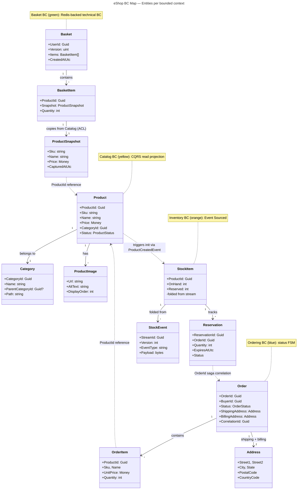

# eShop BC Map — Entities per bounded context (Mermaid source)

> **Render:** paste into any mermaid renderer, or open in drawio via the MCP tool. The live drawio link is in `docs/eshop-master-design.md § 10.2`.
>
> Modeled as a mermaid `classDiagram` — each BC's entities shown with their key fields and cross-BC references labeled on dashed edges. Matches the DDD context-map style of showing entities per bounded context with shared identifiers on the seams.

## Cross-BC reference conventions

- Solid arrows within a BC → composition / ownership
- Dashed arrows across BCs → **reference by ID only** (never by aggregate type — enforced by architecture tests, see `architecture-tests.md`)
- `ProductId` is the most-shared identifier; it appears in Basket's `ProductSnapshot`, Ordering's `OrderItem`, and Inventory's `StockItem` streams
- `OrderId` is the correlation key for the Checkout saga's Ordering ↔ Inventory handshake
- `UserId` (from Keycloak JWT `sub` claim) is NOT shown here — it's omnipresent and owned by Keycloak (not by any BC) per [ADR-0005](../adr/0005-customer-data-in-ordering.md)
