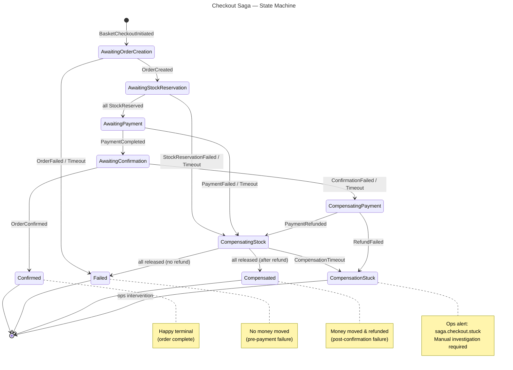

# Checkout Saga — State Machine (Mermaid source)

> **Render:** paste into any mermaid renderer, or open in drawio via the MCP tool. The live drawio link is in `docs/eshop-master-design.md § 10.2`.

## State glossary

| State | Kind | Meaning |
|---|---|---|
| `AwaitingOrderCreation` | Working | `CreateOrderCommand` published; waiting for `OrderCreatedEvent` |
| `AwaitingStockReservation` | Working | N `ReserveStockCommand`s fanned out (one per distinct ProductId); waiting for all `StockReservedEvent`s |
| `AwaitingPayment` | Working | `RequestPaymentCommand` published to `payments.payment-commands` (delegated to `PaymentProcessingSaga` per [ADR-0023](../adr/0023-payments-event-vs-command-classification.md)); waiting for `PaymentCompletedEvent`/`PaymentFailedEvent` |
| `AwaitingConfirmation` | Working | `ConfirmOrderCommand` published; waiting for `OrderConfirmedEvent` |
| `CompensatingStock` | Recovery | Releasing all active reservations via `ReleaseReservationCommand` |
| `CompensatingPayment` | Recovery | Refund requested via `RequestRefundCommand`; waiting for `PaymentRefundedEvent` |
| `Confirmed` | Terminal | Happy path — order is complete |
| `Failed` | Terminal | No money moved; reached when pre-payment step failed and stock already released |
| `Compensated` | Terminal | Money moved **and** refunded; reached when post-confirmation step failed |
| `CompensationStuck` | Terminal abnormal | Compensation exceeded `CompensationTimeout`; **ops alert fires** |

See [bc-design/checkout-saga.md](../bc-design/checkout-saga.md) for full transition table, timeout config, and compensation matrix.
