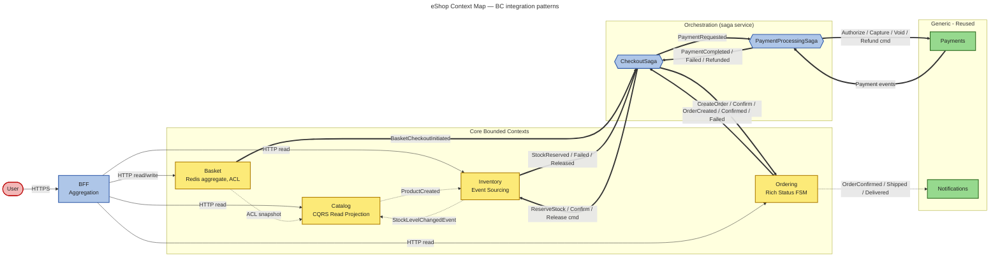

# Context Map — Mermaid source

> **Render:** paste into any mermaid renderer, or open in drawio via the MCP tool. The live drawio link is in `docs/eshop-master-design.md § 10.2`.

## Legend

- **Solid arrow** (`-->`) — synchronous HTTP call
- **Dashed arrow** (`-.->`) — fire-and-forget published event (Kafka)
- **Thick arrow** (`==>`) — saga-mediated command or event flow (Kafka)

## Integration pattern reference

| Edge | Pattern |
|---|---|
| BFF → services | Customer/Supplier (HTTP) |
| Basket → Catalog | **Anti-Corruption Layer** (Basket copies into `ProductSnapshot`) |
| Catalog → Inventory | **Published Language** (`ProductCreatedEvent`) |
| Inventory → Catalog | **Published Language** (`StockLevelChangedEvent` on threshold crossing) |
| Basket ↔ CheckoutSaga | Saga trigger |
| CheckoutSaga ↔ {Ordering, Inventory, PaymentSaga} | **Saga orchestration** (commands out, events in) |
| Ordering → Notifications | **Published Language** (order lifecycle events) |
