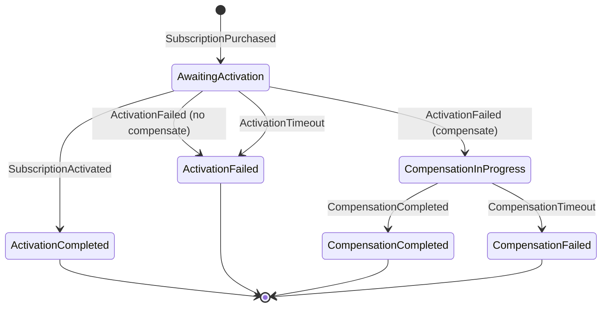

# DotNetAtlas.Sagas.WorkerService

A saga orchestration service implementing the **Saga Pattern** for distributed transactions using MassTransit state machines, Kafka messaging, and Entity Framework Core persistence.

## Overview

This worker service orchestrates long-running distributed transactions across multiple services. It uses the **orchestration-based saga pattern** to coordinate operations and handle compensation (rollback) when failures occur.

### Key Features

- **MassTransit State Machines** - Declarative saga orchestration with automatic state persistence
- **Kafka Integration** - Event-driven messaging with Avro serialization via Schema Registry
- **Entity Framework Core** - SQL Server-backed saga state persistence with optimistic concurrency
- **OpenTelemetry** - Full observability with distributed tracing and metrics
- **Health Checks** - Comprehensive health monitoring including stuck saga detection

## Architecture

### Project Structure

```
DotNetAtlas.Sagas.WorkerService/
├── Common/
│   ├── Config/              # Configuration options (SagaOptions, topics, health checks)
│   ├── Extensions/          # Host environment extensions
│   ├── Observability/       # OpenTelemetry instrumentation
│   └── *.cs                 # DI registration, health checks
├── Persistence/
│   └── Database/            # EF Core DbContext and entity mappings
└── WeatherAlerts/
    └── PurchaseAlertSubscriptionSaga/
        ├── Commands/        # Compensation commands
        ├── Consumers/       # Kafka message consumers
        ├── Events/          # Internal saga events
        ├── Observability/   # Saga-specific activities
        ├── Schedules/       # Timeout schedules
        └── *.cs             # State machine and state
```

## Subscription Purchase Saga

The main saga orchestrates the subscription purchase flow between Billing and Weather Alert services.

### State Diagram



### Flow

1. **SubscriptionPurchased** → Billing service publishes event when payment succeeds
2. **AwaitingActivation** → Saga waits for Weather service to activate subscription
3. **SubscriptionActivated** → Success path, saga completes
4. **ActivationFailed** → If compensation needed, triggers refund command
5. **CompensationCompleted** → Refund processed, saga completes

### Kafka Topics

| Topic | Direction | Purpose |
|-------|-----------|---------|
| `billing.subscriptions` | Consume | Subscription purchased/refund completed events |
| `weather.subscriptions` | Consume | Subscription activated events |
| `billing.commands` | Produce | Refund request commands (compensation) |

## Configuration

### appsettings.json

```json
{
  "Saga": {
    "ActivationTimeoutMinutes": 5,
    "CompensationTimeoutMinutes": 30,
    "MaxRetryAttempts": 3,
    "RetryDelaySeconds": 5,
    "ConcurrencyLimit": 10,
    "KafkaBootstrapServers": "localhost:9094",
    "SchemaRegistryUrl": "http://localhost:8081",
    "Topics": {
      "BillingSubscriptions": "billing.subscriptions",
      "WeatherSubscriptions": "weather.subscriptions",
      "BillingCommands": "billing.commands"
    },
    "ConsumerGroup": "saga-orchestrator"
  }
}
```

### Key Options

| Option | Description |
|--------|-------------|
| `ActivationTimeoutMinutes` | Time to wait for activation before timing out |
| `CompensationTimeoutMinutes` | Time to wait for refund before marking failed |
| `ConcurrencyLimit` | Max concurrent saga instances |
| `MaxRetryAttempts` | Retry attempts for transient failures |

## Health Checks

The service exposes health check endpoints:

- `/health/ready` - Readiness probe
- `/health/live` - Liveness probe
- `/health` - Detailed health status

### Saga Health Check

Monitors for stuck sagas that exceed the configured threshold:

```json
{
  "SagaHealthCheck": {
    "StuckSagaThresholdMinutes": 30,
    "MaxStuckSagasBeforeDegraded": 5,
    "MaxStuckSagasBeforeUnhealthy": 20
  }
}
```

## Running Locally

### Prerequisites

- .NET 9.0+
- SQL Server (for saga state persistence)
- Kafka with Schema Registry
- Docker (recommended for local dependencies)

### Start the Service

```bash
dotnet run --project saga/DotNetAtlas.Sagas.WorkerService
```

## Testing

```bash
# Unit tests
dotnet test saga/DotNetAtlas.Sagas.UnitTests

# Integration tests
dotnet test saga/DotNetAtlas.Sagas.IntegrationTests
```

## Observability

### Metrics

Custom metrics are exposed via OpenTelemetry:

- `saga.started` - Counter for saga instances started
- `saga.completed` - Counter for successful completions
- `saga.compensated` - Counter for compensated sagas
- `saga.duration` - Histogram of saga durations

### Tracing

Distributed traces include:
- Saga lifecycle events
- Kafka message consumption
- Database operations
- Compensation flows

